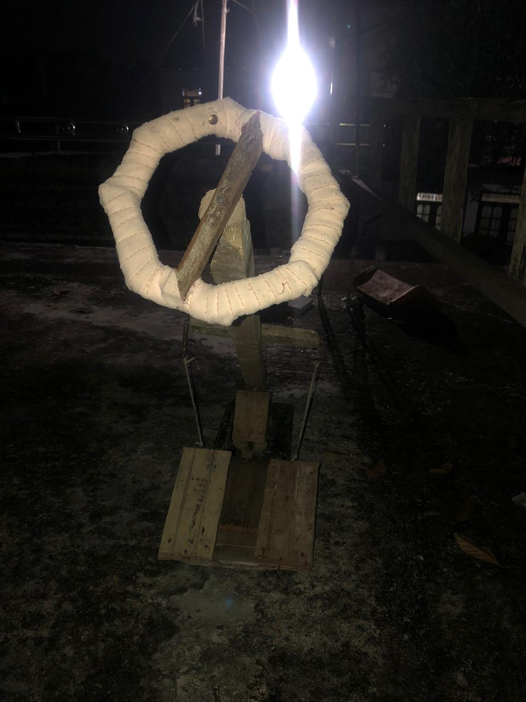
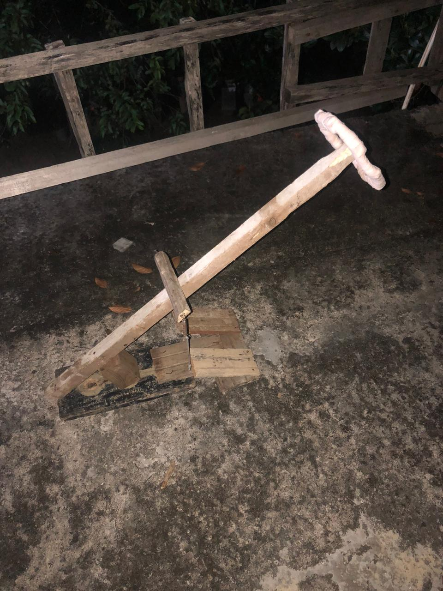
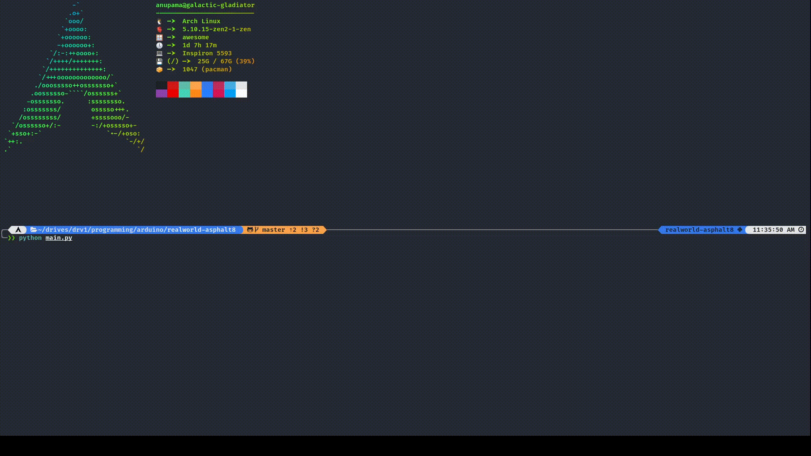

# Real World - Asphalt8

real world asphalt (RWA in short) is a physical controller for Asphalt8 (by changing keys can be used in other games). Since python can't directly communicate with arduino firmata is used as a bridge. following are some demos of the project.



<br><br>


### Prerequisites

- Python 3.7 or later
- poetry (optinal)
- an arduino
- 3 buttons (script will run without buttons)

### Running the project

first clone the project

```
git clone https://github.com/Anu2001dev/realworld-asphalt8
cd realworl-asphalt8
```

installs deps (you can install via pip but poetry is recommended)

`pip`

```
pip installl -r requirements.txt
```

`poetry`

```
poetry install
```

finally

```
python main.py
```

## Built With

- [Poetry](https://python-poetry.org/) - Dependency Management
- [Rich](https://github.com/willmcgugan/rich) - Logging Colorized Output
- [Pyfirmata](https://github.com/tino/pyFirmata) - Python Firmata Client
- [PyAutoGUI](https://github.com/asweigart/pyautogui) - Pressing Keys

## Builders

- **Me** - Code
- **Visal Ranindu** - All the mechanical work

## License

This project is licensed under the MIT License - see the [LICENSE.md](LICENSE.md) file for details
